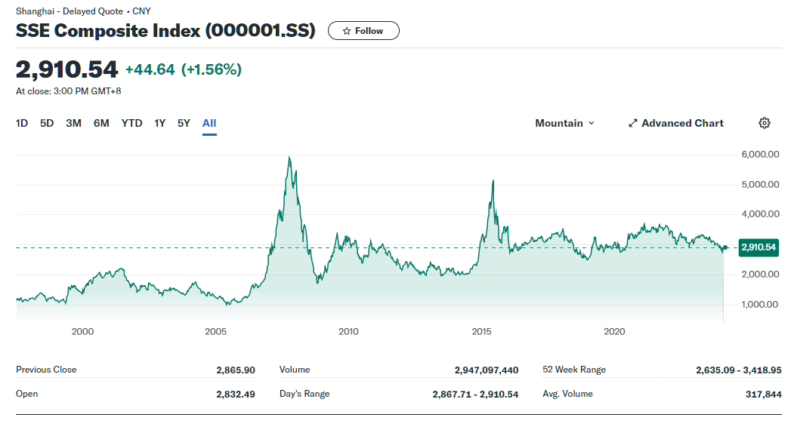

# 对股市价格数据的分析

---

量化投资的输入包括各种各样的数据

要获取数据，首先要了解数据的种类以及数据的意义。

假设我们量化投资的目标是股票，也就是说我们要通过和股票有关的数据作为输入。

对大多数人来讲，股票最直观的数据就是股价了，也就是那个折来折去的曲线。

以上是上证指数的价格曲线，这是一个时间序列数据，横轴是时间，纵轴是价格。

> 虽然指数严格上来讲不是具体的某一只股票，但是指数可以看作是多个股票的加权平均（实际上可能会复杂一点），也有价格，所以我们可以把指数看作是一种股票。

现在我们面对的是一张**股价-时间**关系图，接下来我们来简单分析一下。

这是一份二维数据，横轴是时间，纵轴是价格，而且这个图表具有函数的性质，也就是说对于一个特定的时间，它对应一个特定的价格。

我们知道现实世界中的时间是连续的（是的，我们的起点是牛顿力学和相对论，接受它就好了），但是股价的数据是离散的，因为价格最细就是到分（小数点后两位）。

为了彻底解构我们所面临的问题，我们肯定要将其分解至无法再分为止。根据股票价格变动的原理可以知道，影响价格的直接因素并不是时间，而是每一笔交易，每一笔交易之间的时间间隔是不固定的，即我们可以知道不同股价之间的变化是跳动的，而不是连续的。

[//]: # (可以加入一张模型图)

为了方便建模，现实中将股价-时间的关系图离散化，也就是说我们将时间划分为间隔相等的时间点（每秒、每分钟、每小时、每天、每周、每月、每年等），然后在每个时间点上记录股价。

> 没错，在这样的模型下，两个相邻的时间点之间的股价变化会被忽略，但是绝大多数情况下这不会影响我们的分析。

于是我们可以总结：

[//]: # (todo: )
